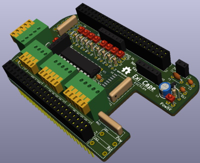
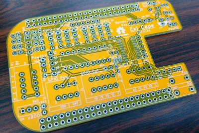

# Exi Cape

## 1.はじめに

[BeagleBoard](https://beagleboard.org/)に、産業機器を接続するためのインターフェースボード([CAPE](https://beagleboard.org/capes))です。

**Note**

Please import this library before using this repository.
<https://github.com/trihome/KiCad_MyLibrary>

## 2.仕様

[回路図](./doc/ExiCape.pdf)

|機能|仕様|補足|
|:--|:--|:--|
|出力|4ch|非絶縁。シンク（NPN）・ソース（PNP）駆動切り替え可能。各chの動作確認LEDあり。|
|入力|4ch|〃|
|AD変換|10bit 2ch|非絶縁・入力保護のダイオード付き|
|暗号化|ATECC508A/608A|[NervesKey](https://github.com/nerves-hub/nerves_key)の接続に対応|
|外部操作スイッチ|Power, Reset, μBoot||
|外部UART端子|あり x 1|Beagle Bone GreenのUARTに直結|
|電源|5V系/24V系は個別に供給|ポリスイッチ（過電流防止）あり|

## 3.License

This is under [CC-BY-SA](https://creativecommons.org/licenses/by-sa/4.0/).
